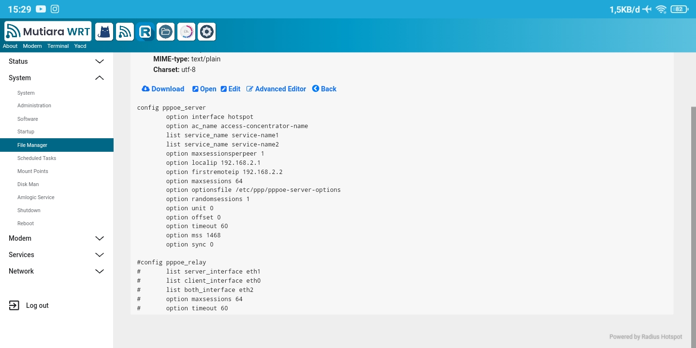
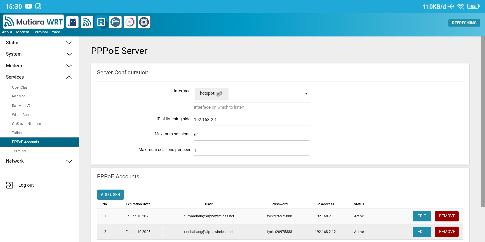

<div align="center">
  <h1>PPPOE ACCOUNT MANAGEMENT</h1>
</div>

<div align="center">
  <a target="_blank" href="https://github.com/Taufik-N-A/luci-app-pppoe-account-management/releases"></a>
</div>
<hr/>
  
<p align="center">
<a href="https://t.me/Taufik_N_A"></a>
<a href="https://www.youtube.com/@taufiknurohmanafiko5377"></a>
</p>
<hr/>

### luci-app-pppoe-account-management for openwrt
<hr/>

> [!WARNING]
>
> - for openwrt version 22 and below use v2.0, and for openwrt version 23 use v2.1
>

Features
---
- Add & Remove Users pppoe
- Expiration date account

installation
---
- Download rp-pppoe-server in the luci openwrt software menu
- Download the IPK file according to the firmware you are using
- upload the ipk file to the root folder
- Open the terminal for installation luci pppoe account management app, copy to the following 3 codes:
```shell
cd
```
```shell
ls
```
```shell
opkg update && opkg install *.ipk
```
- open tinyfm then open the etc/config/pppoe folder, and change the # sign in the pppoe_server config as the following example:
 <p>
  </img>
 </p>
- Open the PPPoE Account in the service menu and according to the settings then create an account, for example as follows:
  <p>
  </img>
 </p>
- To automatically delete an expired account, you can enter this code in the Scheduled Tasks menu:

```shell
0 0 * * * /user/bin/pppoe-checker && /etc/init.d/pppoe-server restart
```

Credit
---
<ul>
  <li>Owner : <a href="https://github.com/Taufik-N-A" target="_blank">TAUFIK</a></li>
</ul>
