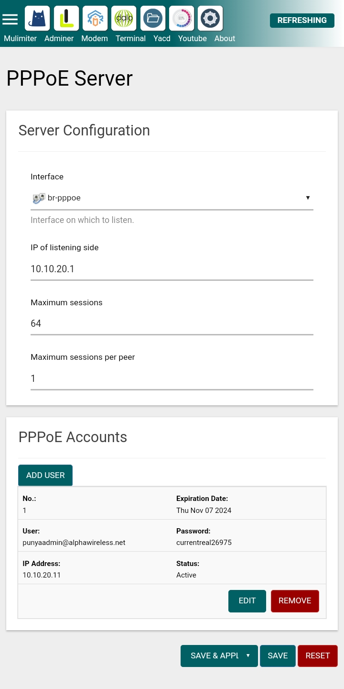

  <h1>PPPOE ACCOUNT MANAGEMENT</h1>

  

Features
---
- Add & Remove Users pppoe
- Expired date account

Credit
---
<ul>
  <li>Owner : <a href="https://github.com/Taufik-N-A" target="_blank">TAUFIK</a></li>
</ul>

Image
---

Screenshot

 

  
 

